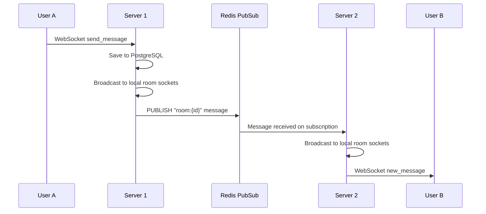

# Raw Stack Rewrite + Missing Features

## Current State

The app currently depends on 4 frameworks that abstract away the core distributed systems concepts:

- **Express** -- HTTP routing, middleware, body parsing
- **Socket.io** -- WebSocket abstraction, rooms, reconnection, Redis adapter
- **Prisma** -- ORM, query builder, migrations
- **simple-peer** -- WebRTC abstraction (client)

## What We Keep

- **Redis** (`redis` npm) -- infrastructure, not a framework
- **PostgreSQL** (`pg` npm) -- database driver, not an ORM
- **bcrypt** / **jsonwebtoken** -- crypto libraries, not frameworks
- **React** -- frontend stays as-is (only backend + WebRTC go raw)
- **Nginx** / **Docker** -- infrastructure

---

## Phase 1: Custom HTTP Server + Router (replace Express)

Create a lightweight HTTP framework from scratch in `src/lib/`.

**New files:**

- `src/lib/router.js` -- A custom `Router` class supporting `get()`, `post()`, path params (`:id`), and middleware chains
- `src/lib/parseBody.js` -- JSON body parser (reads `req` stream, parses JSON)
- `src/lib/cors.js` -- CORS header handler (reads `Origin`, sets `Access-Control-`* headers)
- `src/lib/response.js` -- Helper to attach `res.json()` and `res.status()` to the raw `http.ServerResponse`

**Modified files:**

- [src/server.js](src/server.js) -- Replace `express()` with `http.createServer` + custom router. The request handler matches routes, runs middleware, and calls handlers.
- [src/routes/auth.js](src/routes/auth.js), [src/routes/rooms.js](src/routes/rooms.js), [src/routes/users.js](src/routes/users.js) -- Convert from `Router()` to the custom router API (minimal changes since the handler signatures stay similar).
- [src/middleware/auth.js](src/middleware/auth.js) -- Works as-is since it only uses `req`/`res`/`next`.

The custom router should support:

```javascript
router.post('/api/auth/register', parseBody, async (req, res) => { ... });
router.get('/api/rooms/:id/messages', authMiddleware, async (req, res) => { ... });
```

**Why this is impressive:** You demonstrate understanding of HTTP parsing, URL pattern matching, and middleware pipelines -- the same concepts Express hides behind `app.use()`.

---

## Phase 2: Raw WebSocket Server (replace Socket.io)

This is the most impactful change. Socket.io abstracts rooms, reconnection, and cross-instance pub/sub. We rebuild all of that.

**New files:**

- `src/lib/ws.js` -- WebSocket server wrapper using the `ws` npm package. Handles:
  - JWT authentication during the HTTP upgrade handshake (parse token from query string)
  - A custom JSON message protocol: `{ event: "send_message", data: { roomId, content } }`
  - Room management: `Map<roomId, Set<WebSocket>>` for tracking which sockets are in which room
  - `broadcast(roomId, event, data)` -- sends to all sockets in a room
- `src/lib/redisPubSub.js` -- Manual Redis pub/sub to replace `@socket.io/redis-adapter`. When a message is sent on server1, it publishes to a Redis channel. Server2 subscribes and forwards to its local WebSocket clients.

**Modified files:**

- [src/server.js](src/server.js) -- Attach `ws` server to the `http.Server` instance via the `upgrade` event
- [src/sockets/index.js](src/sockets/index.js) -- Rewrite event handlers to use the custom protocol instead of Socket.io's `socket.on('event')`. Parse incoming JSON, switch on `event` field.

**Client-side changes:**

- [client/src/context/SocketContext.jsx](client/src/context/SocketContext.jsx) -- Replace `socket.io-client` with native browser `WebSocket`. Implement:
  - Token passed via URL: `new WebSocket(\`ws://host:3000?token={token})`
  - JSON message protocol matching the server
  - Manual reconnection logic (exponential backoff)
  - Event emitter pattern to replace `socket.on()`

**Message protocol design:**

```
Client -> Server:  { "event": "send_message", "data": { "roomId": "...", "content": "..." } }
Server -> Client:  { "event": "new_message", "data": { "id": "...", "sender": {...}, ... } }
```

**Cross-instance flow with Redis:**




---

## Phase 3: Raw SQL (replace Prisma)

Replace Prisma ORM with the `pg` driver and hand-written SQL.

**New files:**

- `src/lib/db.js` -- PostgreSQL connection pool using `pg.Pool`
- `src/db/migrations/001_init.sql` -- The schema SQL (we already have this from Prisma's migration, we just own it directly now)
- `src/db/migrations/002_friendships.sql` -- New friendship table (Phase 5)

**Modified files:**

- [src/config/database.js](src/config/database.js) -- Replace `PrismaClient` with `pg.Pool`
- [src/services/authService.js](src/services/authService.js) -- Replace `prisma.user.findFirst()` / `prisma.user.create()` with raw SQL:

```sql
  SELECT id, username, email FROM users WHERE email = $1 OR username = $2 LIMIT 1
  INSERT INTO users (id, username, email, password_hash, updated_at) VALUES ($1,$2,$3,$4,NOW()) RETURNING id, username, email, avatar_url, created_at
  

```

- [src/services/messageService.js](src/services/messageService.js) -- Replace Prisma queries with SQL using JOINs
- [src/services/roomService.js](src/services/roomService.js) -- Replace Prisma queries with SQL (the most complex one, uses transactions for room + members creation)
- [src/services/userService.js](src/services/userService.js) -- Replace Prisma queries with `ILIKE` search

**Why this is impressive:** You demonstrate understanding of SQL joins, transactions, connection pooling, and parameterized queries (preventing SQL injection) rather than hiding behind an ORM.

---

## Phase 4: Native WebRTC (replace simple-peer)

Replace the `simple-peer` library with the browser's native `RTCPeerConnection` API.

**Modified files:**

- [client/src/components/CallModal.jsx](client/src/components/CallModal.jsx) -- Replace `new SimplePeer(...)` with:

```javascript
  const pc = new RTCPeerConnection({ iceServers: [...] });
  stream.getTracks().forEach(track => pc.addTrack(track, stream));
  pc.ontrack = (e) => setRemoteStream(e.streams[0]);
  // Initiator: pc.createOffer() -> pc.setLocalDescription() -> send via signaling
  // Receiver: pc.setRemoteDescription(offer) -> pc.createAnswer() -> send via signaling
  

```

- Handle ICE candidates with `trickle: true` (more efficient than simple-peer's `trickle: false`)
- [client/package.json](client/package.json) -- Remove `simple-peer`, `buffer`, `process`, `vite-plugin-node-polyfills` (all were needed only for simple-peer's Node.js polyfills)

**Server-side:** The WebRTC signaling in [src/sockets/index.js](src/sockets/index.js) stays nearly identical -- it just relays offers/answers/candidates. The protocol changes to match the raw WebSocket format from Phase 2.

---

## Phase 5: Friendship System (new feature from PDF)

The PDF requires a friendship system (the original project had a `Friendship` table). Your current app has none.

**New migration -- `002_friendships.sql`:**

```sql
CREATE TYPE "FriendshipStatus" AS ENUM ('PENDING', 'ACCEPTED', 'REJECTED');

CREATE TABLE "friendships" (
    "id" TEXT NOT NULL PRIMARY KEY,
    "requester_id" TEXT NOT NULL REFERENCES "users"("id") ON DELETE CASCADE,
    "addressee_id" TEXT NOT NULL REFERENCES "users"("id") ON DELETE CASCADE,
    "status" "FriendshipStatus" NOT NULL DEFAULT 'PENDING',
    "created_at" TIMESTAMP(3) NOT NULL DEFAULT CURRENT_TIMESTAMP,
    "updated_at" TIMESTAMP(3) NOT NULL DEFAULT CURRENT_TIMESTAMP,
    UNIQUE("requester_id", "addressee_id")
);
```

**New files:**

- `src/services/friendshipService.js` -- `sendRequest()`, `acceptRequest()`, `rejectRequest()`, `getFriends()`, `getPendingRequests()`
- `src/routes/friends.js` -- REST endpoints:
  - `POST /api/friends/request` -- send friend request
  - `POST /api/friends/accept/:id` -- accept request
  - `POST /api/friends/reject/:id` -- reject request
  - `GET /api/friends` -- list accepted friends
  - `GET /api/friends/pending` -- list pending requests

**WebSocket events:**

- When a friend request is sent, push a `friend_request` event to the target user in real-time
- When accepted, push `friend_accepted` to the requester

**Client changes:**

- [client/src/services/api.js](client/src/services/api.js) -- Add `friendsApi` with matching endpoints
- New component: `client/src/components/FriendsList.jsx` -- shows friends with online status
- New component: `client/src/components/FriendRequests.jsx` -- pending request UI
- [client/src/pages/RoomList.jsx](client/src/pages/RoomList.jsx) -- Add a friends panel alongside the conversations list

---

## Phase 6: Offline Message Delivery (new feature from PDF)

The PDF requires: "deliver sender's message to receiver once the receiver is back online." Currently, messages are stored in PostgreSQL but there's no mechanism to push missed messages on reconnect.

**Implementation using Redis:**

- When sending a message and the target user is offline, push the message ID to a Redis list: `RPUSH pending:{userId} {messageId}`
- On WebSocket connection, check `LRANGE pending:{userId} 0 -1` for pending message IDs
- Fetch those messages from PostgreSQL and send them immediately over the WebSocket
- After delivery, `DEL pending:{userId}`

**Modified files:**

- `src/lib/redisPubSub.js` -- Add `queueForOfflineUser(userId, messageId)` and `getPendingMessages(userId)` functions
- [src/sockets/index.js](src/sockets/index.js) -- On connection, call `getPendingMessages()` and emit them. On `send_message`, check if recipients are online; if not, queue.

---

## Dependency Changes

**Backend `package.json` -- remove:**

- `express`, `cors`, `@socket.io/redis-adapter`, `socket.io`, `@prisma/client`, `prisma`

**Backend `package.json` -- add:**

- `ws` (raw WebSocket server)
- `pg` (PostgreSQL driver)
- `uuid` (for generating IDs, previously handled by Prisma)

**Client `package.json` -- remove:**

- `simple-peer`, `socket.io-client`, `buffer`, `process`, `vite-plugin-node-polyfills`

---

## Execution Order

Phases should be done in order (1 through 6) because each builds on the previous. Phase 1 is the foundation, Phase 2 is the most complex, and Phases 5-6 add features on top of the raw stack.