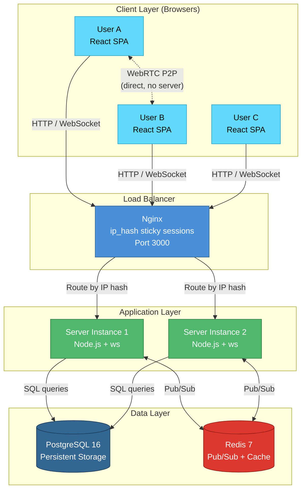
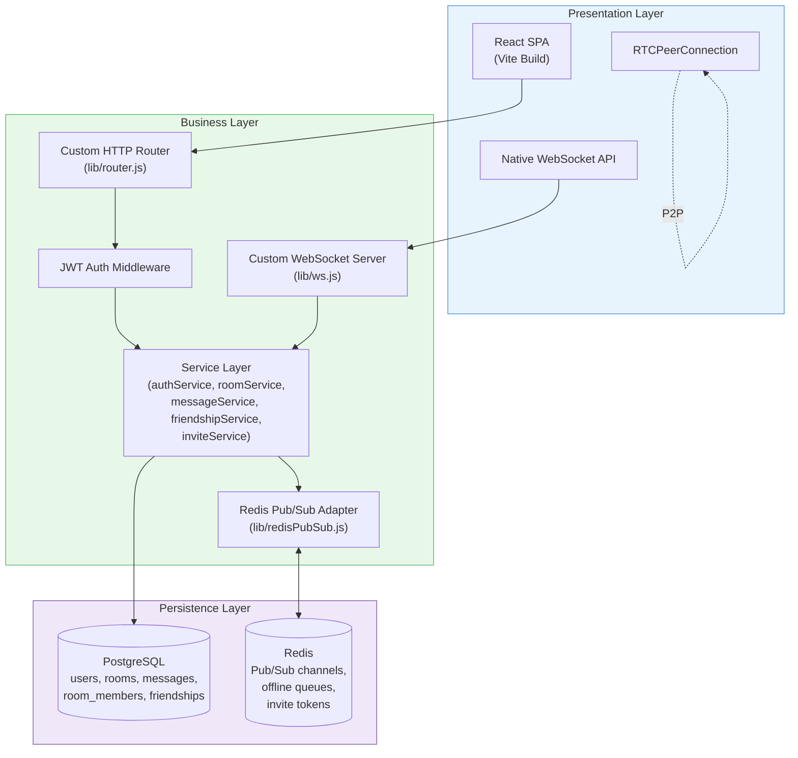
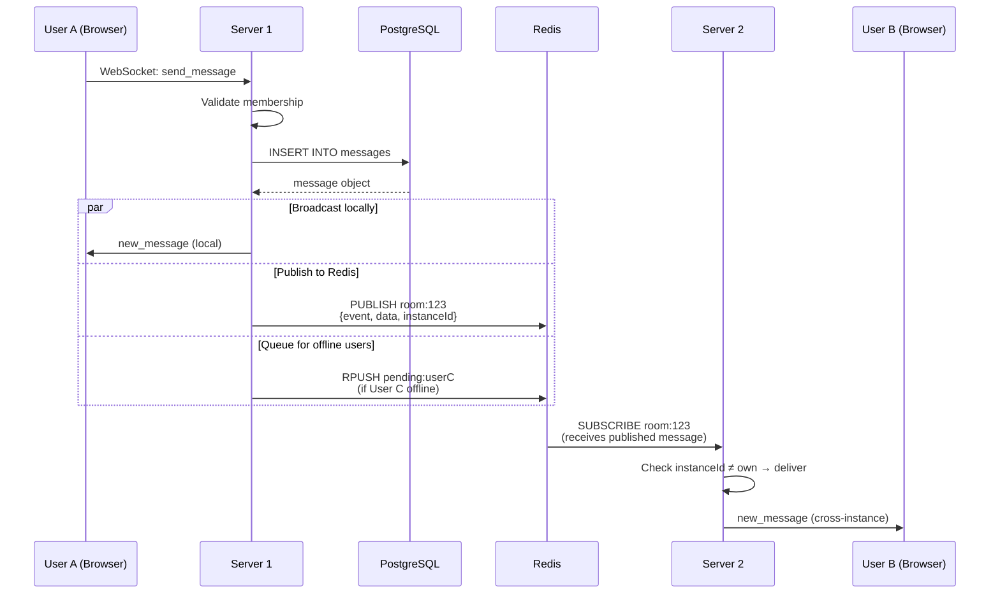
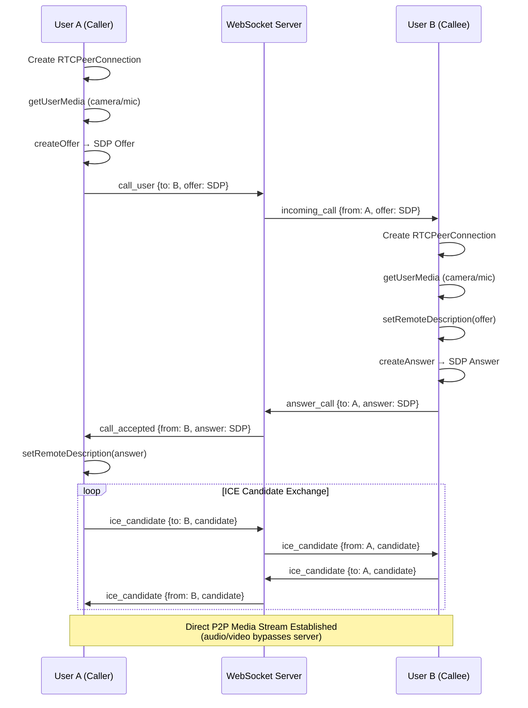
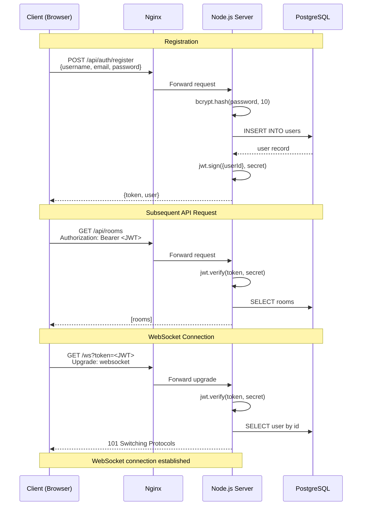
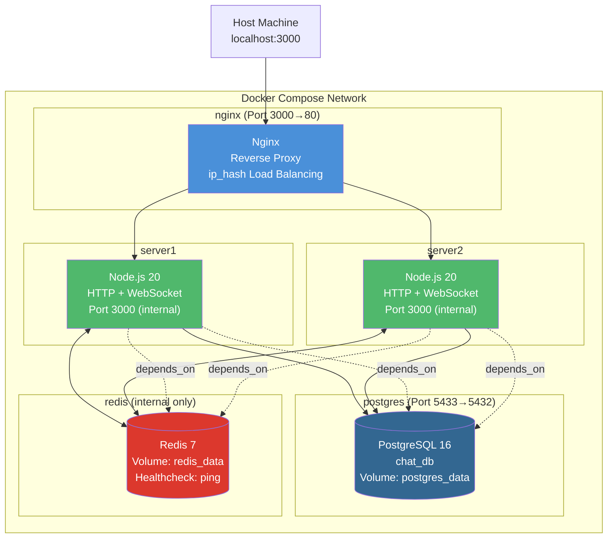
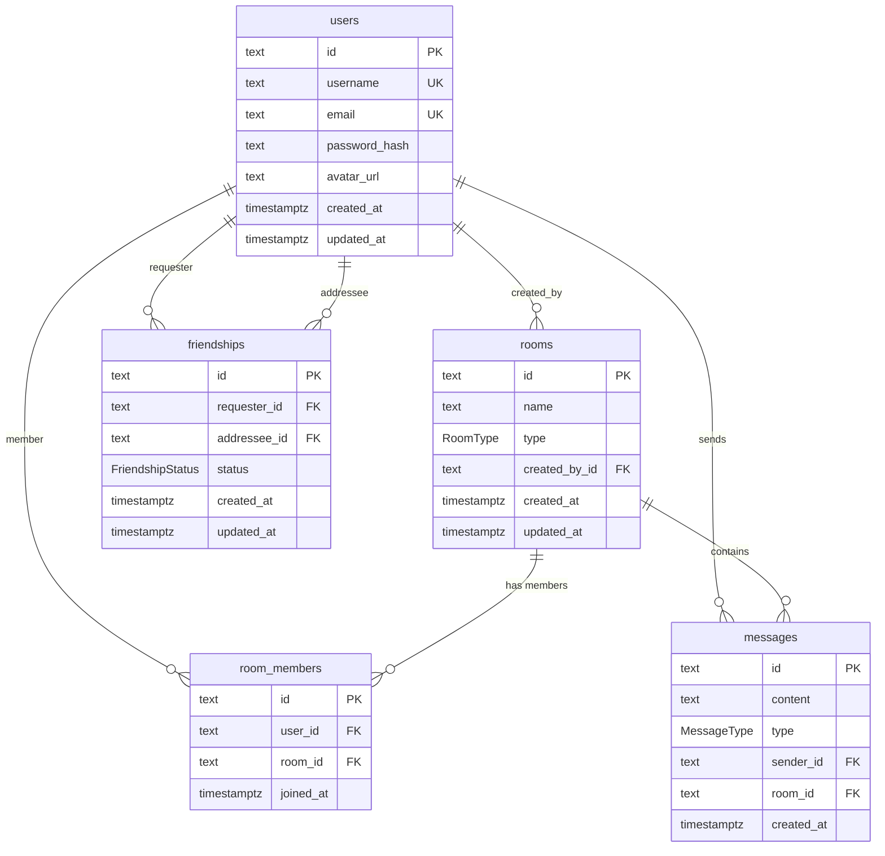
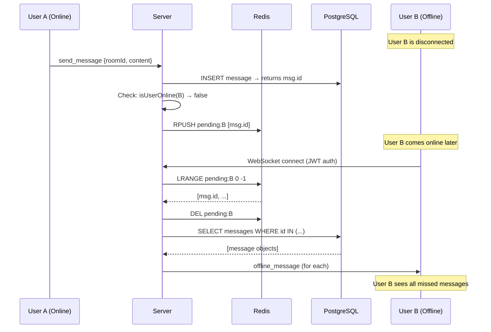
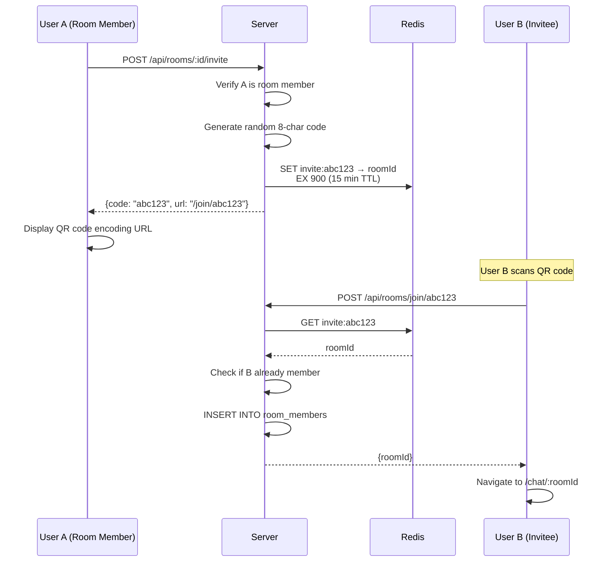
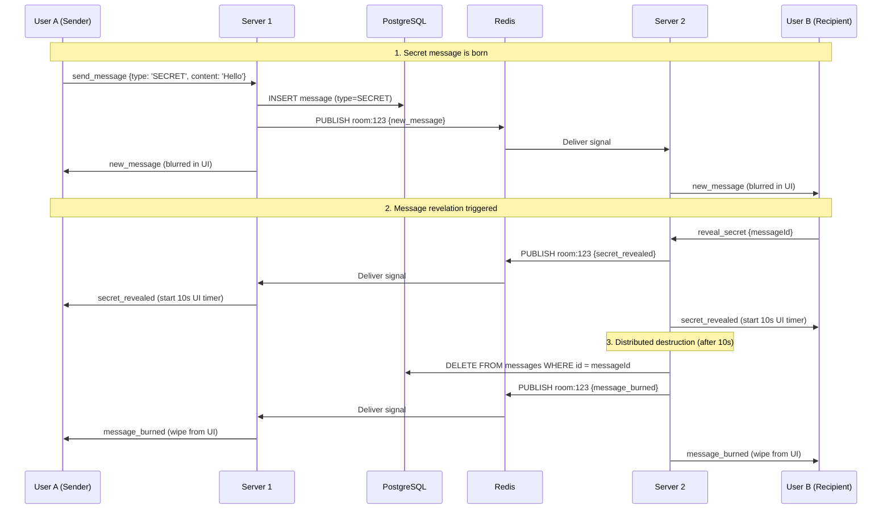

# Architecture Diagrams

Render these Mermaid diagrams at https://mermaid.live or in any Mermaid-compatible tool, then export as PNG/SVG for your PowerPoint slides.

---

## Diagram 1 — High-Level System Architecture

---

## Diagram 2 — Three-Layer Architecture

---

## Diagram 3 — Cross-Instance Message Flow

---

## Diagram 4 — WebRTC Signaling Flow

---

## Diagram 5 — Authentication Flow

---

## Diagram 6 — Docker Deployment Diagram

---

## Diagram 7 — Database Entity Relationship

---

## Diagram 8 — Offline Message Delivery

---

## Diagram 9 — QR Code Invite Flow

---

## Diagram 10 — Pulse (Burn-After-Reading) Lifecycle

---

## How to Export Diagrams

1. Go to **https://mermaid.live**
2. Paste each Mermaid code block into the editor
3. Click **Actions → Export PNG** (or SVG)
4. Save with descriptive filenames (e.g., `system_architecture.png`)
5. Insert into your PowerPoint slides
